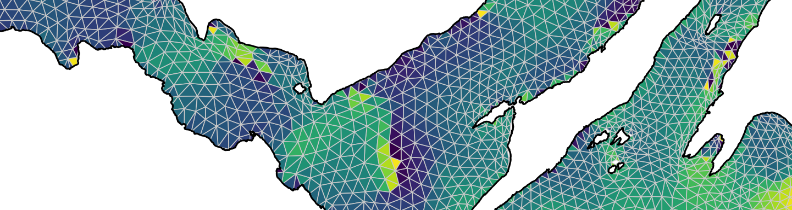

Flapper skate (*Dipturus intermedius*) and the Red Rocks and Longay
Marine Protected Area
================
Edward Lavender1,2\*

1 Centre for Research into Ecological and Environmental
Modelling, University of St Andrews, Scotland  
2 Scottish Oceans Institute, University of St Andrews,
Scotland

\* This repository is maintained by Edward Lavender
(<el72@st-andrews.ac.uk>).

## Introduction

This repository contains methods, written in `R` and organised as an `R
Project`, for the exploration of flapper skate (*Dipturus intermedius*)
egg count–area scaling relationships and hydrodynamic conditions in the
Red Rocks and Longay Marine Protected Area (MPA). These methods support
Dodd et al. (in press). First report of an egg nursery for the
Critically Endangered flapper skate *Dipturus intermedius* (Rajiformes:
Rajidae). Aquat. Conserv.

Hydrodynamic conditions across the MPA at large and in locations where
eggs were found specifically were explored using the West Scotland
Coastal Ocean Modelling System (WeStCOMS) (Aleynik et al., 2016). This
modelling system resolves hourly hydrodynamic conditions across an
unstructured, triangular mesh that is organised into 11 vertically
spaced, terrain-following Sigma layers (the 1st layer lies at the
surface, the 10th layer lies at the seabed and 11th layer lies below the
seabed). Scalar variables, such as temperature, are resolved at mesh
nodes, while vector variables, including current velocity vectors, are
resolved at mesh centroids (elements). In this study, model predictions
from a one-year period were used to analyse hydrodynamic conditions via
the fvcom.tbx R package (Lavender, 2020).

For the MPA at large, two analyses were implemented:

1)  **Current speed.** The mean current speed and the range predicted
    for the area were calculated from hourly current velocity vector
    predictions for the deepest elements (approximately 5–20 m above the
    seabed, depending on location) over the analysed period.
2)  **Temperatures.** Spatiotemporal variation in bottom temperatures
    was explored using hourly temperature predictions for the 10th Sigma
    layer over the analysed period. Time series plot were used to
    visualise annual temperature trends and their relationship with
    depth.

For the WeStCOMS elements/nodes nearest to the stations in which eggs
were located, near-bottom current speeds and temperature trends were
examined in the same way in relation to conditions across the MPA at
large.

For the sites with eggs, data on egg counts were also used to examine
egg count–area scaling relationships and to estimate the area expected
to contain different numbers of eggs. These analyses will guide the
identification of further flapper skate egg nurseries in the future.

## Structure

1.  **`data-raw/`** contains ‘raw’ data for the project:
      - `eggs/` contains egg survey data; namely:
          - `RR&L - locations where eggs were found and depth.xlsx`,
            sourced from Jane Dodd;
          - `egg_counts.xlsx`, assembled from data sourced from Jane
            Dodd;
      - `spatial/` contains spatial data; namely:
          - `coast/` contains coastline data for the region, sourced
            from the [Database of Global Administrative
            Areas](https://biogeo.ucdavis.edu/data/gadm3.6/Rsp/gadm36_GBR_0_sp.rds);
          - `mesh/` contains WeStCOMS mesh files, sourced from [Dmitry
            Aleynik](https://www.sams.ac.uk/people/researchers/aleynik-dr-dmitry/)
            at the Scottish Association for Marine Science (SAMS);
          - `mpa/` contains a shapefile of the MPA boundaries, sourced
            from NatureScot;
      - WeStCOMS model predictions are also required for this project.
        Local files are stored externally, but can also be obtained from
        the [SAMS Thredds
        Server](https://www.sams.ac.uk/facilities/thredds/);   
2.  **`data/`** contains processed data and results:
      - `spatial/` contains processed spatial data (from
        `process_data_raw.R`);
      - `wc/` contains results, from `analyse_*` `R` scripts (see
        below);   
3.  **`R/`** contains scripts for data processing and analysis:
      - `define_global_param.R` defines global parameters;
      - `process_data_raw.R` processes raw data;
      - `analyse_current.R` analyses current velocities;
      - `analyse_temp.R` analyses bottom temperatures;   
4.  **`fig/`** contains figures.

Note that the `data-raw`, `data` and `fig` directories are not provided
in the online version of this repository.

## Workflow

1.  **Define global parameters** via `define_global_param.R`.

2.  **Process raw data** via `process_data_raw.R`.

3.  **Implement WeStCOMS analysis** via `analyse_current.R` and
    `analyse_temp.R`.

4.  **Implement egg-counts analysis** via `analyse_eggs.R`.

*Figure 1. Example outputs from the `red_rocks_westcoms` project: trends
in the minimum and maximum predicted hourly bottom temperature though
time and with depth across the WeStCOMS mesh in the Red Rocks and Longay
Marine Protected Area. The red line shows the maximum temperature and
the blue line shows the minimum temperature. Line thickness is
proportional to the depth of the seabed at the WeStCOMS node in which
the minimum/maximum temperature was predicted.*

# GitHub packages

This repository uses a number of non-default packages, available from
[The Comprehensive R Archive Network](https://cran.r-project.org). These
can be installed with `install.packages()`. Four packages that are only
available on [GitHub](https://github.com/) are also used:

  - [`fvcom.tbx`](https://github.com/edwardlavender/fvcom.tbx). This
    package is used for WeStCOMS analyses.
  - [`flapper`](https://github.com/edwardlavender/flapper). This package
    is used for parallelisation routines.
  - [`prettyGraphics`](https://github.com/edwardlavender/prettyGraphics).
    This package is used for plotting.
  - [`utils.add`](https://github.com/edwardlavender/utils.add). This
    package is used for summarising data.

## References

Aleynik, D. et al. (2016). A high resolution hydrodynamic model system
suitable for novel harmful algal bloom modelling in areas of complex
coastline and topography. Harmful Algae 53, 102–117.
<doi:10.1016/j.hal.2015.11.012>.

Dodd, et al. (in press). First report of an egg nursery for the
Critically Endangered flapper skate *Dipturus intermedius* (Rajiformes:
Rajidae). Aquat. Conserv.

Lavender, E. (2020). fvcom.tbx: An R toolbox for the unstructured grid
Finite Volume Community Ocean Model (FVCOM). R package version 0.1.0.
Available at: <https://github.com/edwardlavender/fvcom.tbx>.
